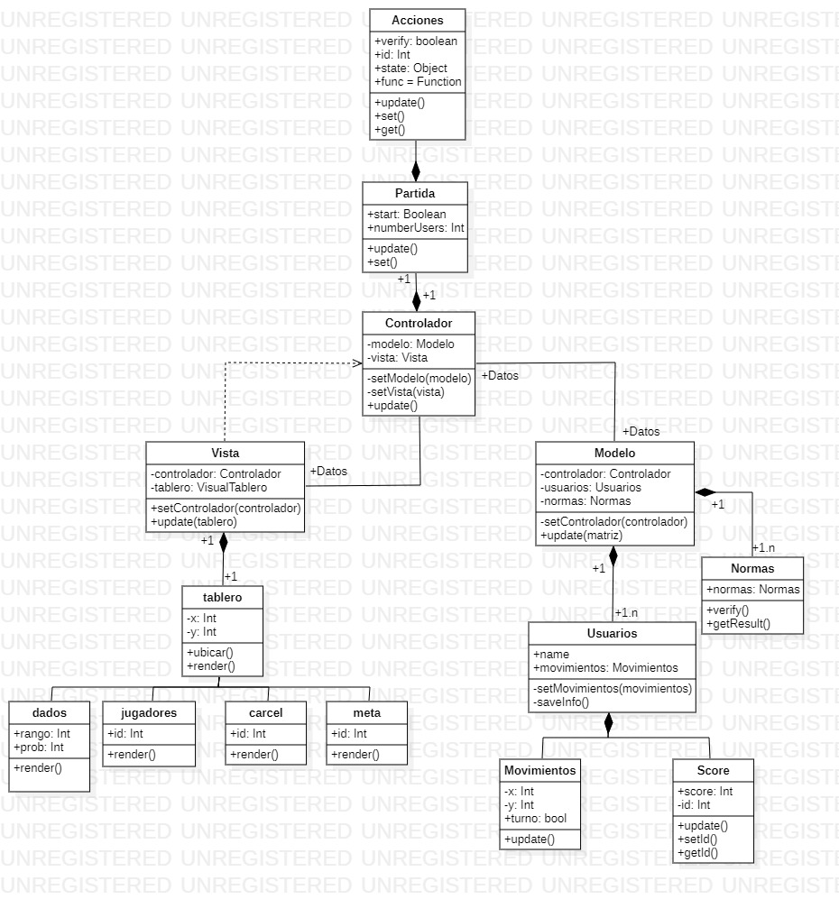

# Juego Parqués - 

Este programa simula una estructuración MVC para ejecutar un juego de parqués para cuatro jugadores.

## Modelado principal:

Nuestro programa en esencia se rige por el UML mostrado a continuación

